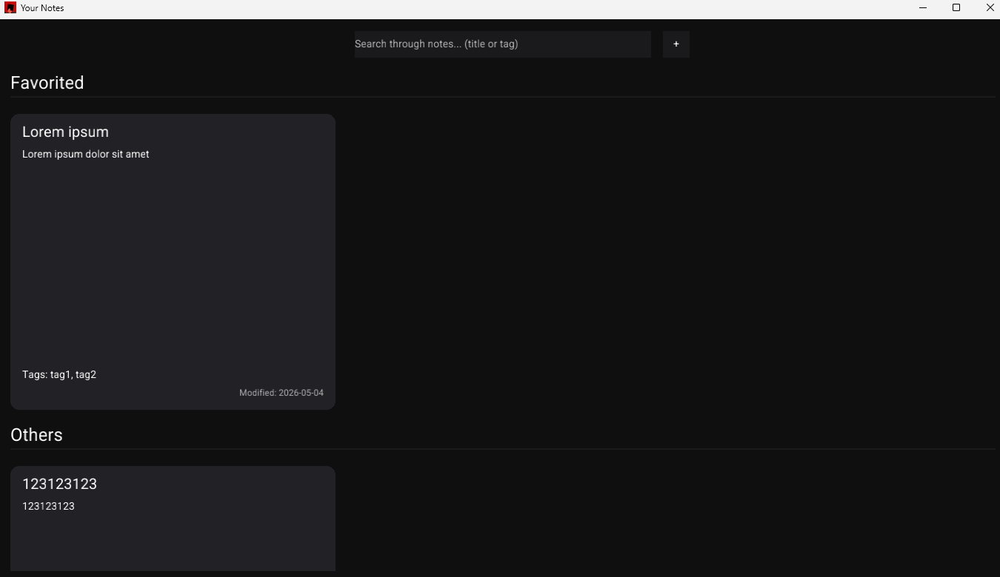
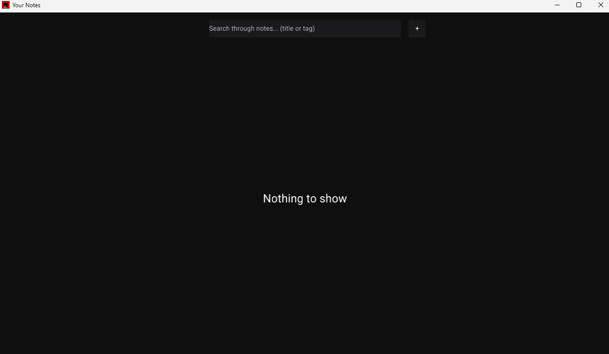
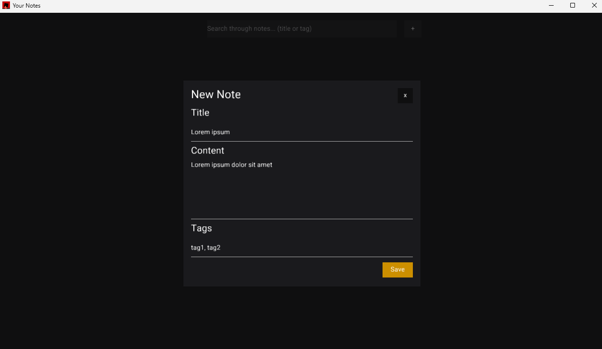
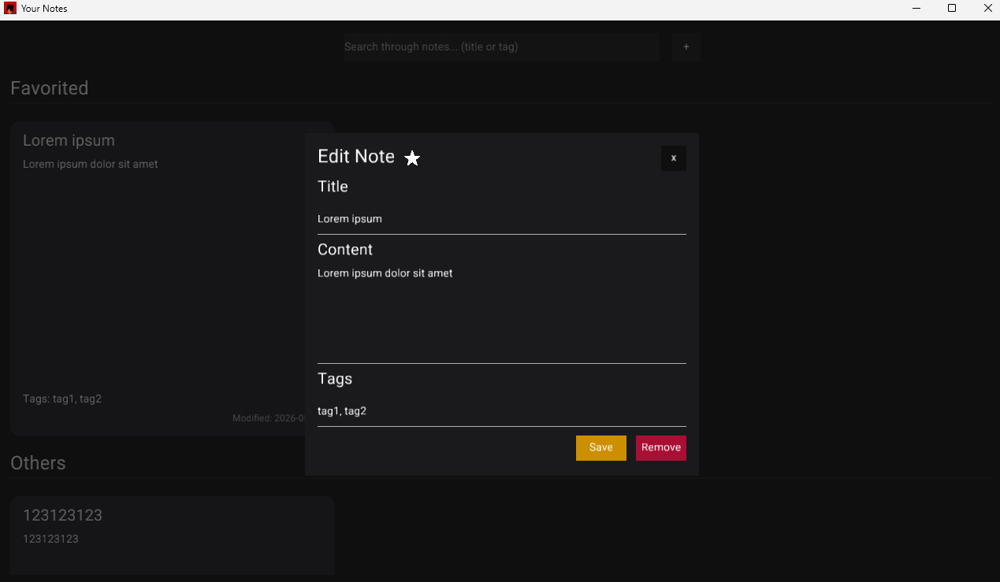
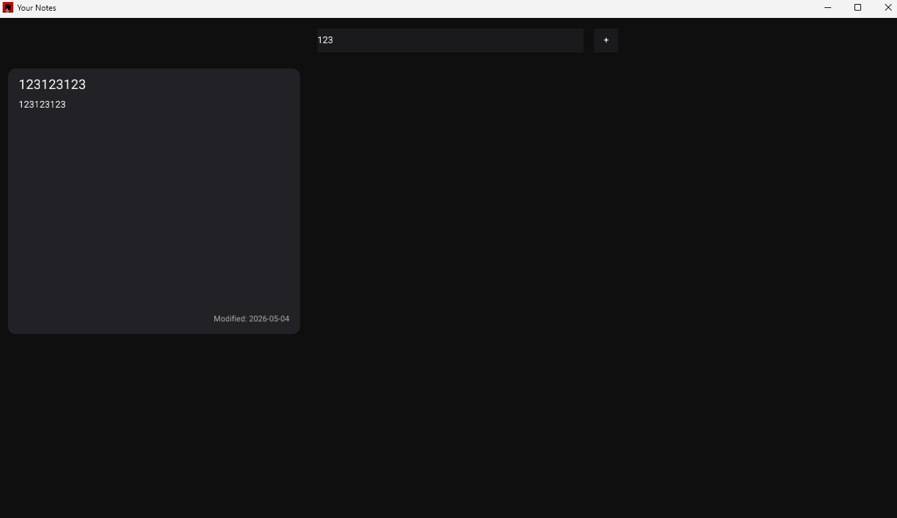

# Aplikacja do zarządzania notatkami
> [!NOTE]
> Aplikacja korzysta z silnika **[Ply](https://plyx.iz.rs)**, który jest dosyć nowy - z tego powodu występują pewne ograniczenia związane z funkcjami interfejsu oraz błędy wizualne - ale wykonuje swoje zadanie.



<details>
  <summary>Pozostałe obrazy z aplikacji</summary>
  
  ### Brak notatek
  

  ### Dialog tworzenia notatki
  

  ### Dialog edycji notatki
  

  ### Wyszukiwanie notatek
  
  
</details>

Funkcjonalości:
* Przeglądanie notatek w dwóch sekcjach: "Favorited" i "Others"
* Tworzenie, edycja, usuwanie i polubianie notatek
* Wyszukiwanie notatek na podstawie tytułów i tagów

UI dzieli się na:
* Nagłówek (Header)
  * Pasek wyszukiwania
  * Przycisk dodawania nowej notatki
* Główny widok (Main)
  * Siatka z notatkami z podziałem na kategorie
  * Posiada możliwość przewijania góra/dół
* Dialog (Modal)
  * Nakładka w trybie dodawania lub edycji notatki

Struktura `AppState` przechowuje stan interfejsu:
```rs
struct AppState {
    notes_list: NotesList,
    show_dialog: bool,
    editing_note: Option<Uuid>,
}
```
gdzie:
* `notes_list` - notatki wczytywane przy starcie aplikacji.
* `show_dialog` - flaga decydująca o tym, czy modal tworzenia lub edycji jest widoczny.
* `editing_note` - identyfikator obecnie edytowanej notatki.

---

## lib.rs
Zawiera logiczną część zarządzania notatkami:
* dodawanie, usuwanie i polubianie,
* serializacja i deserializacja do/z formatu JSON,
* zapis i odczyt do/z pliku `.json`.

### Struktura
```rs
pub struct Note {
    pub id: Uuid,
    pub title: String,
    pub content: String,
    pub tags: Vec<String>,
    pub modification_date: NaiveDate,
    pub favorite: bool,
}

pub struct NotesList {
    pub notes: Vec<Note>,
}
```
